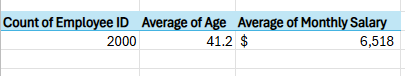
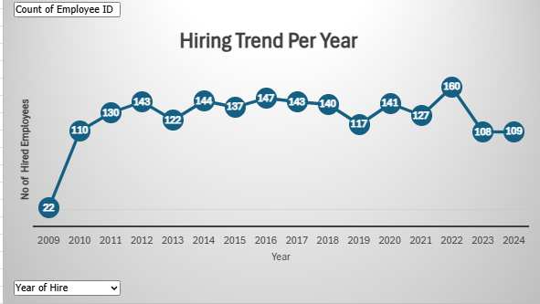
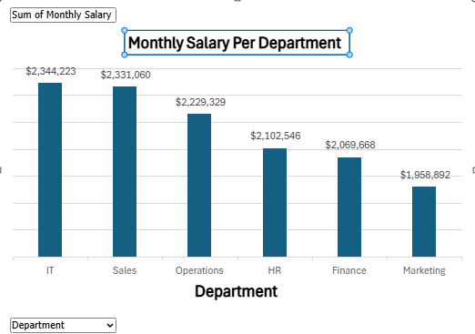

# employee-data-analysis-excel
Data analysis project using Excel to explore employee performance, salaries, and HR insights
## 🖼️ Project Preview
## Dashboard - Top 5 salary earners, Hiring Trend per Year, KPIs, Performance ratings per education level and Gender distribution accross department

### 📊 KPI Dashboard

### 💰 Top 5 Salary Earners

### 👴 Longest Serving Employees

### 📈 Hiring Trend Per Year

### 💸 Monthly Salary by Department

### 📚 Performance Ratings vs Education Level

### 👥 Gender Distribution Across Departments

### 🚫 Absentees per Department
 <!-- This file actually shows all absentee records -->

### 🧾 Longest Serving Employees

## 📌 Project Summary

This project explores employee data using Microsoft Excel, with the goal of deriving actionable HR insights. It covers areas such as salary distribution, absenteeism trends, departmental performance, and gender representation. Using PivotTables, conditional formatting, and dashboarding techniques, I built interactive visuals that bring clarity to HR metrics.

### 🔍 Key Highlights:
- KPI dashboard summarizing salary, job satisfaction, and employment trends
- Top 5 salary earners and department-wise salary insights
- Absenteeism records analyzed by department and individual
- Gender and performance analysis based on education levels
- Top 5 serving employees
  
### 🛠 Tools Used:
- Excel PivotTables
- Pivot Charts & Data Visualization
- Slicers for interactivity
- Conditional Formatting

### 💡 Key Takeaways:
- Data storytelling through dashboards
- Leveraging Excel as a business intelligence tool
- Improved understanding of HR analytics

